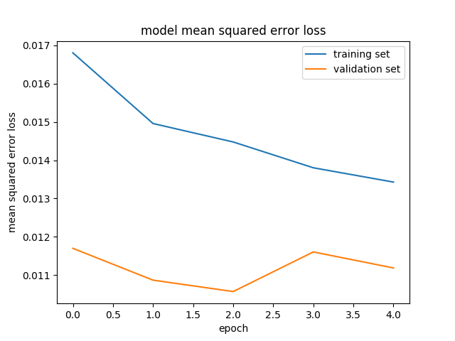

# **Behavioral Cloning**

## Writeup Report

---

**Behavioral Cloning Project**

The goals / steps of this project are the following:
* Use the simulator to collect data of good driving behavior
* Build, a convolutional neural network in Keras that predicts steering angles from images
* Train and validate the model with a training and validation set
* Test that the model successfully drives around track one without leaving the road
* Summarize the results with a written report


[//]: # (Image References)

[image1]: ./examples/placeholder.png "Model Visualization"
[image2]: ./examples/placeholder.png "Grayscaling"
[image3]: ./examples/placeholder_small.png "Recovery Image"
[image4]: ./examples/placeholder_small.png "Recovery Image"
[image5]: ./examples/placeholder_small.png "Recovery Image"
[image6]: ./examples/placeholder_small.png "Normal Image"
[image7]: ./examples/placeholder_small.png "Flipped Image"


## Rubric Points
### Here I will consider the [rubric points](https://review.udacity.com/#!/rubrics/432/view) individually and describe how I addressed each point in my implementation.  

---
### Files Submitted & Code Quality

#### 1. Submission includes all required files and can be used to run the simulator in autonomous mode

My project includes the following files:
* model.py containing the script to create and train the model
* drive.py for driving the car in autonomous mode
* model.h5 containing a trained convolution neural network
* writeup_report.md or writeup_report.pdf summarizing the results

#### 2. Submission includes functional code
Using the Udacity provided simulator and my drive.py file, the car can be driven autonomously around the track by executing
```sh
python drive.py model.h5
```

#### 3. Submission code is usable and readable

The P3.py file contains the code for training and saving the convolution neural network. The file shows the pipeline I used for training and validating the model, and it contains comments to explain how the code works.

### Model Architecture and Training Strategy

#### 1. An appropriate model architecture has been employed

My model architecture (P3.py line 68-83) consists of a convolution neural network from [this](https://developer.nvidia.com/blog/deep-learning-self-driving-cars/) NVIDIA publication.
First, I added a Keras Lambda layer to zero-center the pixel values with +-0.5 variance by applying the following operation to the image pixels:  
<center></center>  
<br />  
I also added a Keras Cropping2D layer as suggesed by the instructor: 70 pixels from below and 25 from the top. This was done to crop non-useful information like the landscape and the hood of the car.
Then, I proceeded as described in the publication, with convolutional layers of 5x5 filters with stride=2 and depths ranging from 24 to 48, followed by convolutional layers with 3x3 filters with stride=1 and depth of 64. Next, there is a flatten layer so that we can now proceed to add dense layers. The dense hidden layers had a range from 1164 to 10 units. Finally, I added an output layer with 1 unit to get the steering angle prediciton.
All layers except the output layer have a ReLU non-linear activation. Since the NVIDIA publication doesn't include max-pooling, dropout or any other form of regularization, I decided to try it as it is. However, in future experiments I will apply them to compare the performance and generalization.  


#### 2. Attempts to reduce overfitting in the model

In order to prevent ovefitting I took the following actions: I observed that the validation loss was increasing after approximately 5 epochs, so I reduced the number of epochs to 5 and applied the Keras `ModelCheckpoint` callback, saving the best model only. I also augmented the dataset with horizontally flipped images so that the model would not only learn to turn mostly left. The model was tested by running it through the simulator and ensuring that the vehicle could stay on the track.

#### 3. Model parameter tuning

The model used an adam optimizer, so the learning rate was not tuned manually (P3.py line 100).

#### 4. Appropriate training data

The training data was recorded by drving on the track 1 from the [Udacity simulator](https://github.com/udacity/self-driving-car-sim). At the beginning I used the sample data provided by Udacity. Since it was not performing very well on the curves nor on the bridge (where road texture changes), I recorded a recovery set of images, focused on re-centering the car when it got closer to the lane border, as well as a couple of sections driving smoothly over the bridge. The training data was shuffled and split into 80% training and 20% validation sets within the keras `model.fit` method.

#### 5. Solution Design Approach

The strategy for deriving a model architecture was to replicate a proven example from a publication, in this case the one from NVIDIA.

My first step was to make the car stay on the road, particularly when turning on curves. The initial data only contained the sample dataset with its flipped image augmentation. Even though the validation loss was low (less than 0.05 MSE) the car was drifting away from the road. It was then that I took the approach of adding more curve and bridge samples, as well as re-centering samples. The last ones were obtained by taking the car close to the edge of the road and recording how I re-centered it. Furthermore, since most of the samples were of straight driving, I skipped a percentage (10%) of these images, in order to balance the curve instances. Additionally, as recommended by the instructor, I added a correction factor (0.08) to the steering angle when the images corresponded to the left or right cameras. This was done given the perspective geometry (see image below), as the angle between destination and camera is smaller when observing from the left camera and turning left; the same goes respectively for the right camera and right turn. On the contrary, the angle is greater when observing from the right camera and turning left; the same goes for the left camera and right turn.

<center></center>  
<center> Angles between the destination and each camera. Source: Udacity.</center>
<br />
These additions improved considerably the autonomous driving, and the validation loss dropped closer to 0.01 MSE. The main adjustments I performed corresponded to the percentage of skipped center images and the compensation angle. When I started, with 30% skipped center images and 2.0 compensation angle, the car drived mostly in zigzag, and when I reduced them to 10% skipped images and 0.08 angle, then it drove quite closely to my own driving skills.  
<br />
<br />
The last applied improvements were reducing the validation split from 30% to 20%, and reducing the number of epochs while keeping the best model as described in section 2 "Attempts to reduce overfitting in the model".
<center></center>

#### 6. Future work
In the future I plan to compare the NVIDIA architecture against others, such as Inception and VGG. I would also like to observe the outcome of using transfer learning with a road driving pre-trained model from scientific literature.

#### 7. Video
The autonomous driving video can be watched [here](https://www.youtube.com/watch?v=E_RBuN7RFIQ).
